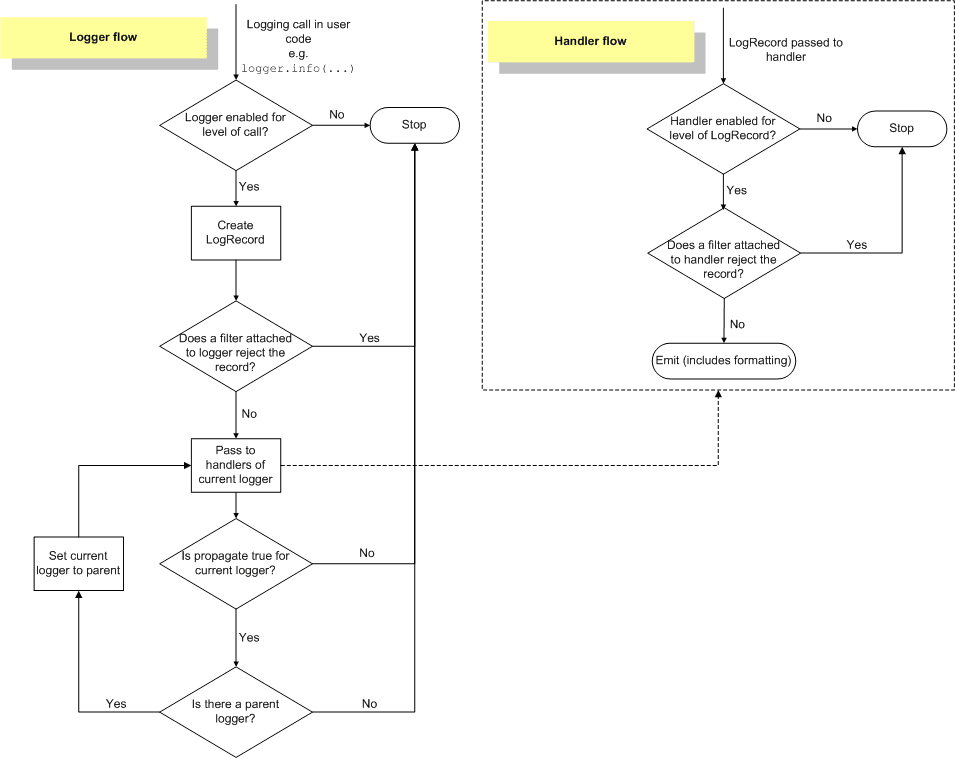

# 介绍

---

logging模块是python自带的，用于记录日志，方便调试。默认分为六种日志级别：NOTSET、DEBUG、INFO、WARNING、ERROR和CRITICAL，默认级别为NOTSET，即所有级别都记录。

## 涉及类

---

### Logger
    日志，暴露函数给应用程序，基于日志记录器和过滤器级别决定哪些日志有效。
    而一个系统只有一个 根Logger 对象，并且该对象不能被直接实例化，获取 Logger 对象的方法为 getLogger。
    即用到了单例模式，这里的单例模式并不是说只有一个 Logger 对象，而是指整个系统只有一个根 Logger 对象，Logger 对象在执行 info()、error() 等方法时实际上调用都是根 Logger 对象对应的 info()、error() 等方法。
    我们可以创造多个 Logger 对象，但是真正输出日志的是根 Logger 对象。每个 Logger 对象都可以设置一个名字，如果设置logger = logging.getLogger(__name__)，__name__ 是 Python 中的一个特殊内置变量，他代表当前模块的名称（默认为 __main__）。则 Logger 对象的 name 为建议使用使用以点号作为分隔符的命名空间等级制度。

### LogRecord
    日志记录器，将日志传到相应的处理器处理。
### Handler
    处理器，将(日志记录器产生的)日志记录发送至合适的目的地。
### Filter
    过滤器，提供了更好的粒度控制,它可以决定输出哪些日志记录。
### Formatter
    格式化器, 指明了最终输出中日志记录的布局。


## 工作流程
1. 判断 Logger 对象对于设置的级别是否可用，如果可用，则往下执行，否则，流程结束。
2. 创建 LogRecord 对象，如果注册到 Logger 对象中的 Filter 对象过滤后返回 False，则不记录日志，流程结束，否则，则向下执行。
3. LogRecord 对象将 Handler 对象传入当前的 Logger 对象，（图中的子流程）如果 Handler 对象的日志级别大于设置的日志级别，再判断注册到 Handler 对象中的 Filter 对象过滤后是否返回 True 而放行输出日志信息，否则不放行，流程结束。
4. 如果传入的 Handler 大于 Logger 中设置的级别，也即 Handler 有效，则往下执行，否则，流程结束。
5. 判断这个 Logger 对象是否还有父 Logger 对象，如果没有（代表当前 Logger 对象是最顶层的 Logger 对象 root Logger），流程结束。否则将 Logger 对象设置为它的父 Logger 对象，重复上面的 3、4 两步，输出父类 Logger 对象中的日志输出，直到是 root Logger 为止。




## 使用方式

### 使用logging.basicConfig，直接进行参数配置

#### 涉及参数

| 参数名称     | 参数描述                                                                                 |
|----------|--------------------------------------------------------------------------------------|
| level    | 日志级别，默认为WARNING                                                                      |
| format   | 日志格式，默认为'%(levelname)s:%(message)s'                                                  |
| datefmt  | 日期格式，默认为'%m-%d %H:%M:%S'                                                             |
| stream   | 日志输出流，定义输出流，用来初始化 StreamHandler 对象，不能 filename 参数一起使用，否则会ValueError 异常，默认为sys.stderr |
| handles  | 定义处理器，用来创建 Handler 对象，不能和 filename 、stream 参数一起使用，否则也会抛出 ValueError 异常，默认为None       |
| filemode | 文件模式，默认为'a'，追加模式，r[+]、w[+]、a[+]                                                      |
| filename | 日志输出到文件的文件名，默认为None                                                                  |
| style    | 格式占位符，默认为 "%"，可以选择 ‘{’ 风格来使用更现代的 {} 格式 |                                              |

#### 日志格式涉及常见变量
| 变量 | 格式 | 变量描述                                                                            |
| --- | --- |---------------------------------------------------------------------------------|
| asctime | %(asctime)s | 将日志的时间构造成可读的形式，默认情况下是精确到毫秒，如 2018-10-13 23:24:57,832，可以额外指定 datefmt 参数来指定该变量的格式 |
| name | %(name)s | 日志对象的名称                                                                         |
| filename | %(filename)s | 打印的日志所在的不包含路径的文件名                                                               |
| pathname | %(pathname)s | 打印的日志所在的包含路径的文件名                                                                        |
| funcname | %(funcname)s | 打印的日志所在的函数名                                                                      |
| levelname | %(levelname)s | 日志级别，如 DEBUG、INFO、WARNING、ERROR、CRITICAL |
| message | %(message)s | 日志信息，即日志内容                                                                      |
| lineno | %(lineno)d | 打印的日志所在的行号                                                                       |
| process | %(process)d | 打印的日志所在的进程号，默认为当前进程号                                                              |
| processName | %(processName)s | 打印的日志所在的进程名，默认为当前进程名                                                          |
| thread | %(thread)d | 打印的日志所在的线程号，默认为当前线程号                                                            |
| threadName | %(threadName)s | 打印的日志所在的线程名，默认为当前线程名                                                          |


#### 示例
```python
import logging

# 输出到控制台
logging.basicConfig(format="%(asctime)s %(name)s:%(levelname)s:%(message)s", datefmt="%d-%m-%Y %H:%M:%S", level=logging.DEBUG)
# 输出到日志文件
logging.basicConfig(filename="test.log", filemode="w", format="%(asctime)s %(name)s:%(levelname)s:%(message)s", datefmt="%d-%m-%Y %H:%M:%S", level=logging.DEBUG)


```

### 使用logging.config读取配置文件配置

#### 从字典中读取配置

```python
import logging.config

config = {
    'version': 1,
    'formatters': {
        'simple': {
            'format': '%(asctime)s - %(name)s - %(levelname)s - %(message)s',
        },
        # 其他的 formatter
    },
    'handlers': {
        'console': {
            'class': 'logging.StreamHandler',
            'level': 'DEBUG',
            'formatter': 'simple'
        },
        'file': {
            'class': 'logging.FileHandler',
            'filename': 'logging.log',
            'level': 'DEBUG',
            'formatter': 'simple'
        },
        # 其他的 handler
        # 默认的
        'default': {
            'level': 'INFO',
            'class': 'logging.handlers.RotatingFileHandler',  # 保存到文件，自动切
            'filename': os.path.join(BASE_LOG_DIR, "info.log"),  # 日志文件
            'maxBytes': 1024 * 1024 * 50,  # 日志大小 50M
            'backupCount': 3,  # 最多备份几个
            'formatter': 'standard',
            'encoding': 'utf-8',
        },
        # 专门用来记错误日志
        'error': {
            'level': 'ERROR',
            'class': 'logging.handlers.RotatingFileHandler',  # 保存到文件，自动切
            'filename': os.path.join(BASE_LOG_DIR, "err.log"),  # 日志文件
            'maxBytes': 1024 * 1024 * 50,  # 日志大小 50M
            'backupCount': 5,
            'formatter': 'standard',
            'encoding': 'utf-8',
        },
    },
    'loggers':{
        # 默认的logger，无法匹配其他logger对象名时，默认使用它，如果匹配，则使用匹配的logger + 默认的logger
        '': {
            'handlers': ['console', 'file'],
            'level': 'DEBUG',
        },
        'demo': {
            'handlers': ['console'],
            'level': 'DEBUG',
        },
        # xpay模块使用的日志对象
        'app.xpay': {
            'handlers': ['console'],
            'level': 'DEBUG',
        },
        # member模块使用的日志对象，要使用也可以指定在getLogger()方法中指定，如 getLogger('app.member')
        'app.member': {
            # 既有 console Handler，还有 file Handler
            'handlers': ['console', 'file'],
            'level': 'DEBUG',
        },
        # 其他的 Logger，Logger的名字建议使用使用以点号作为分隔符的命名空间等级制度
    }
}

logging.config.dictConfig(config)
StreamLogger = logging.getLogger("StreamLogger")
FileLogger = logging.getLogger("FileLogger")
```

### 从配置文件中获取配置信息

```ini
[loggers]
keys=root,sampleLogger

[handlers]
keys=consoleHandler

[formatters]
keys=sampleFormatter

[logger_root]
level=DEBUG
handlers=consoleHandler

[logger_sampleLogger]
level=DEBUG
handlers=consoleHandler
qualname=sampleLogger
propagate=0

[handler_consoleHandler]
class=StreamHandler
level=DEBUG
formatter=sampleFormatter
args=(sys.stdout,)

[formatter_sampleFormatter]
format=%(asctime)s - %(name)s - %(levelname)s - %(message)s
```

```python
import logging.config

logging.config.fileConfig(fname='test.ini', disable_existing_loggers=False)
logger = logging.getLogger("sampleLogger")
```

### 使用yaml文件配置
```yaml
version: 1
formatters:
  simple:
    format: '%(asctime)s - %(name)s - %(levelname)s - %(message)s'
handlers:
  console:
    class: logging.StreamHandler
    level: DEBUG
    formatter: simple
  
loggers:
  simpleExample:
    level: DEBUG
    handlers: [console]
    propagate: no
root:
  level: DEBUG
  handlers: [console]
```

```python
import logging.config
# 需要安装 pyymal 库
import yaml

with open('test.yaml', 'r') as f:
    config = yaml.safe_load(f.read())
    logging.config.dictConfig(config)

logger = logging.getLogger("sampleLogger")
```


## 实战示例

### 临时禁用日志输出

```python

logger.disabled = True

logging.disable(logging.CRITICAL)
```

### 日志分割

使用 RotatingFileHandler或TimedRotatingFileHandler，分别可以实现按大小和时间划分
```python
# 每隔 1000 Byte 划分一个日志文件，备份文件为 3 个
file_handler = logging.handlers.RotatingFileHandler("test.log", mode="w", maxBytes=1000, backupCount=3, encoding="utf-8")

# 每小时划分一个日志文件，备份文件为 10 个
handler2 = logging.handlers.TimedRotatingFileHandler("test.log", when="H", interval=1, backupCount=10)

```